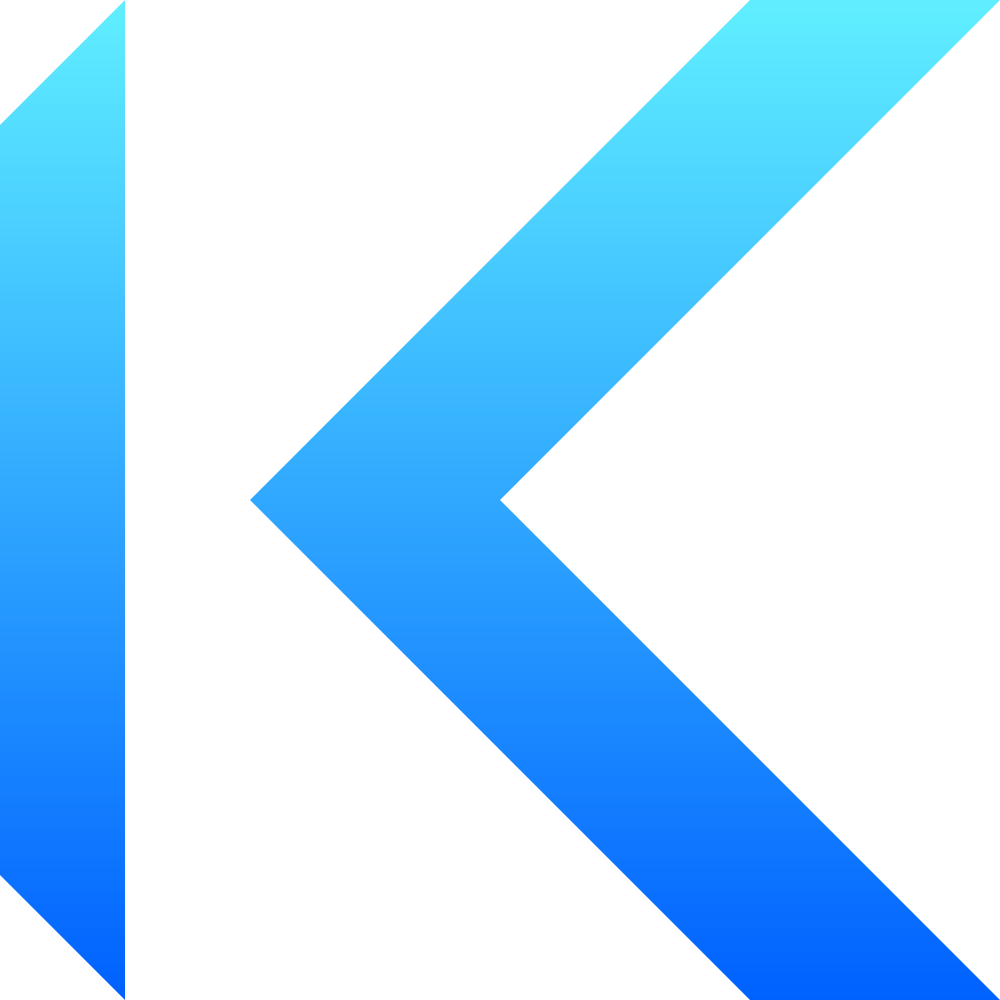
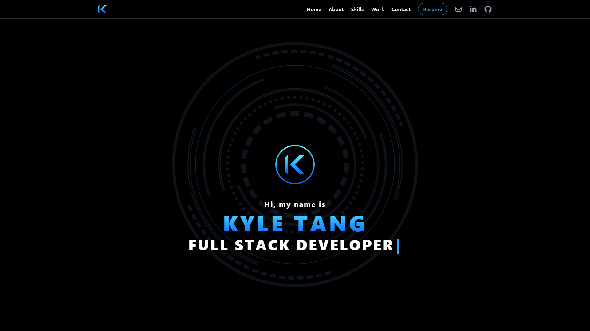

<p align="center">
  
</p>

# My Next.js Portfolio

[](https://opensource.org/licenses/MIT)

## Description

This repository contains my personal web developer portfolio built with modern technologies such as Tailwind CSS, Next.js, TypeScript, and Framer Motion. It is designed to showcase my skills and experience in a modern and visually appealing way. The portfolio is optimized for performance and accessibility with a mobile responsive design. This project is made for developers such as myself who are looking to make an impact in the tech world.

## Table of Contents

- [Installation](#installation)
- [Usage](#usage)
- [Screenshots](#screenshots)
- [Technologies Used](#technologies-used)
- [Credits](#credits)
- [Links](#links)
- [License](#license)

## Installation

This is a [Next.js](https://nextjs.org/) project bootstrapped with [`create-next-app`](https://github.com/vercel/next.js/tree/canary/packages/create-next-app).

To install this project on your local computer, navigate to the `demo` branch of this repository.

The `constants.tsx` and `assets` folder in this branch has dummy information and placeholder images to give developers an idea of how the information is structured in the portfolio.

In the `demo` branch, clone the repository or download it as a ZIP file and place it into a local directory on your computer.

Open a command-line interface (VS Code, Git Bash, etc.) and navigate to the root directory containing the application's package.json.

In the command-line, download the application's dependencies by typing:

```
npm install
```

Next, run the development server:

```bash
npm run dev
```

Open http://localhost:3000 with your browser to see the portfolio.

This portfolio also uses [EmailJS](https://www.emailjs.com/) to send emails via a contact form. Please refer to the [documentation](https://www.emailjs.com/docs/) to learn more about EmailJS and how to set up the required environment variables.

## Usage

When a user first opens the portfolio in their browser, they will be taken to the homepage of the portfolio that will feature a navigation bar at the top and a hero section that will display their name and roles (Web Developer, Software Engineer, etc.)

On smaller screens such as phones, the navigation links will collapse into a menu that can be toggled by the menu button on the top right of the header. Users can scroll or use the navigation links to navigate the portfolio.

This portfolio includes an About, Skills, Work, and Contact section. The About section contains a profile image of the developer and a short biography. The Skills section has a list of technical skills. The Work section consists of six projects, each of them having a screenshot of the project, a description, technologies used, and links to the deployed project and its github repository. In the Contact section, users can send emails by filling out the contact form fields and clicking the submit button.

Users can start editing the portfolio by modifying `constants.tsx` in the utils folder. The page auto-updates as you edit this file.

The `constants.tsx` is where a user can control most of the portfolio's information such as text, external links, image links, skills list, and project information.

Images can be modified by uploading the image files into the `assets` folder of the `public` directory and referenced by name and file type in `constants.tsx`.

For additional personalization such as colors, headings, or extra social links, some modifications may be required in the `globals.css` and the `components` folder.

## Screenshots



## Technologies Used

- Next.js
- React
- TypeScript
- Tailwind CSS
- Framer Motion
- EmailJS
- React Icons
- React Simple Typewriter
- Vercel

## Credits

- [kt946](https://github.com/kt946)

## Links

- [Link to deployed application](https://github.com/kt946/my-nextjs-portfolio)

- [Link to GitHub repository](https://github.com/kt946/my-nextjs-portfolio)

## License

This application is covered under the [MIT](https://opensource.org/licenses/MIT) License.
